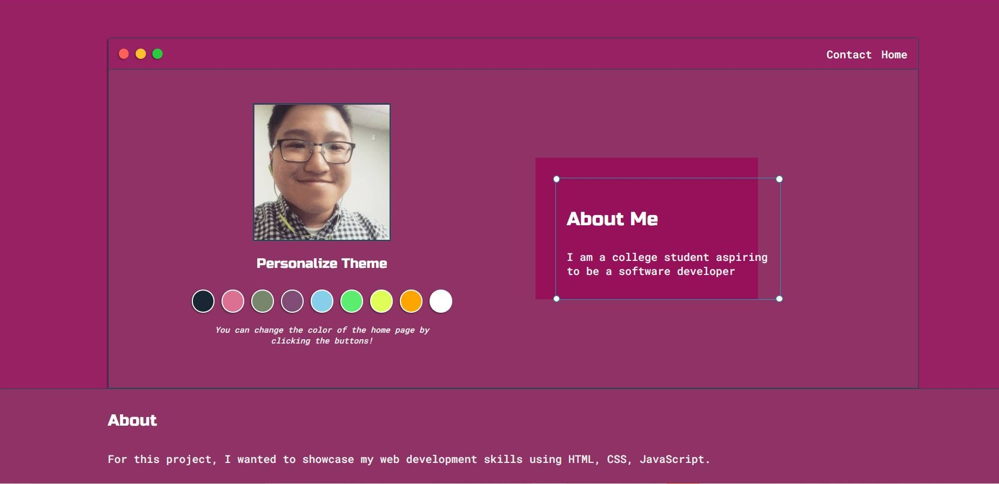
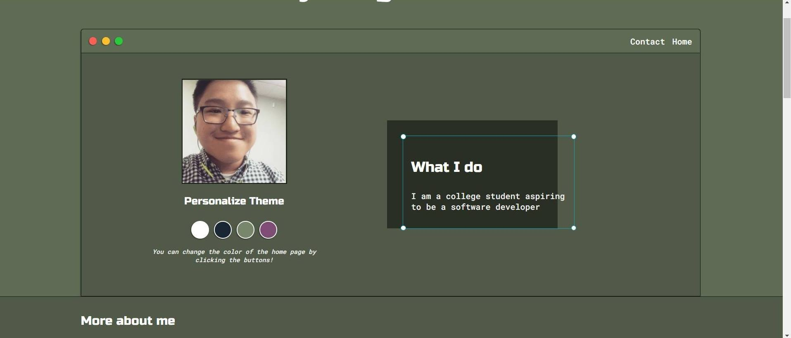
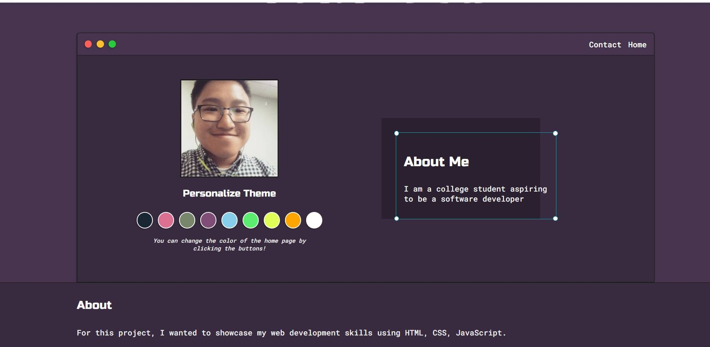
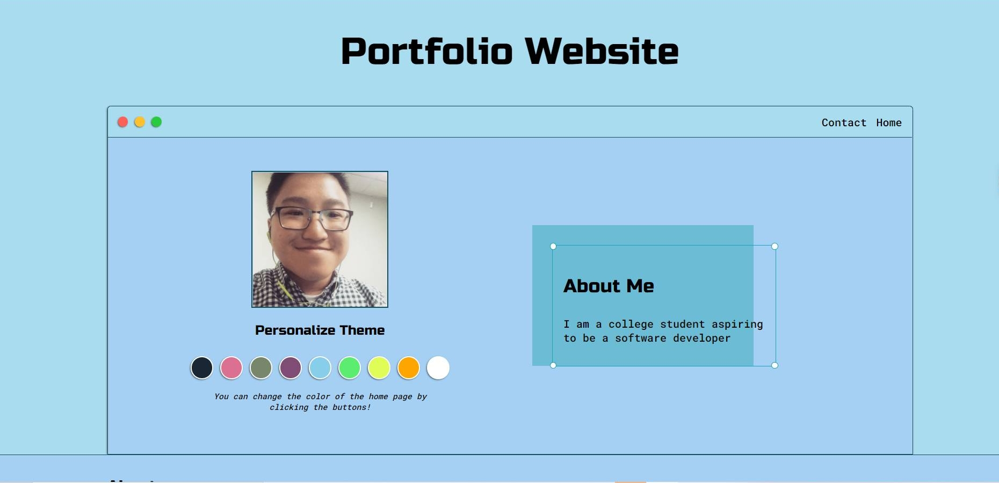
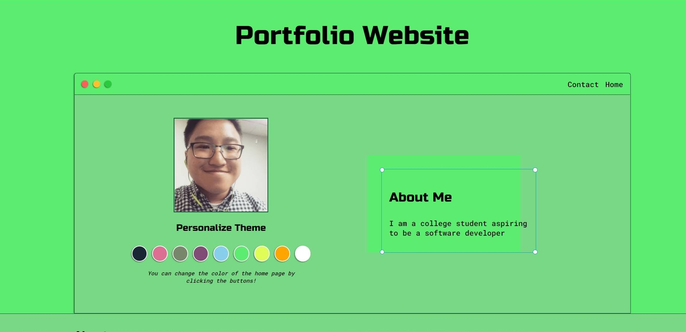
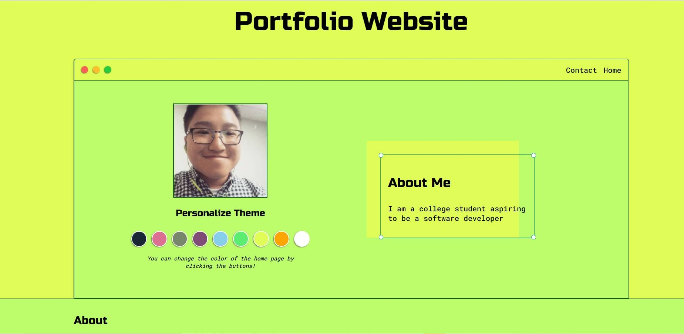
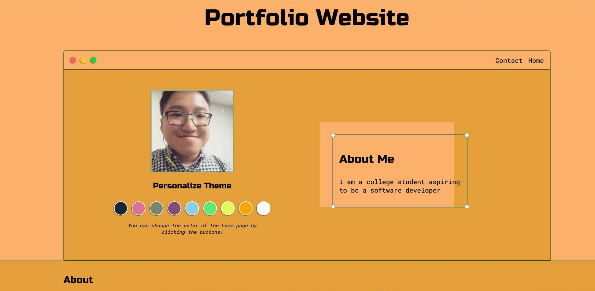
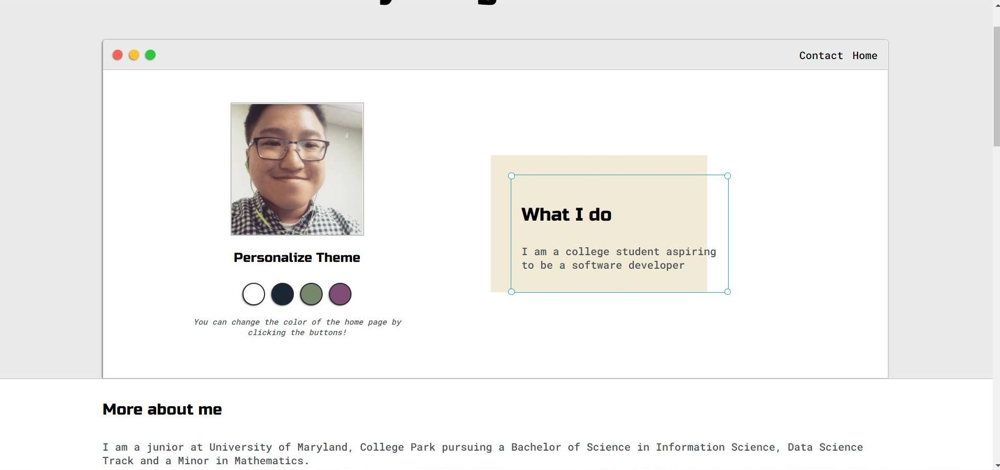

# Portfolio Website

# About
This website is created to highlight my personal projects and contact information. 

The user is able to change theme color of the website by clicking on the buttons prompted

# Documentation
The changing of the color is created using CSS and JavaScript 

The website also allows users to navigate to different pages on the website and enter their contact information into the form, which was created using HTML

Form.io 

The different theme colors are blue,magenta,green, purple, sky blue, neon green, yellow, orange, and white

# Blue Theme

# Magenta Theme

# Green Theme

# Purple Theme

# Sky Blue Theme

# Neon Green Theme

# Yellow Theme 

# Orange Theme

# White Theme

