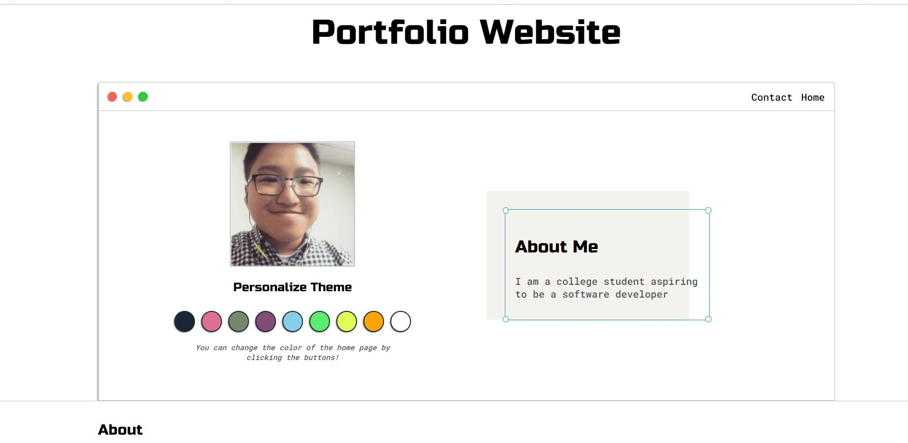

# Portfolio Website

# About
This website is created to highlight my personal projects, skills, courses, certifications, contact information, and personal goals

The user is able to change theme color of the website by clicking on the buttons prompted

# Documentation

JavaScript functions, for loops, and if/else statemnts is used for the changing of theme color

CSS is used for the different theme colors and the overall aesthetic of the website

HTML is used for the navigation bar, the contact form, and the different projects highlighted

The website also allows users to navigate to different pages on the website and enter their contact information into the form, which was created using HTML

Formspree.io is used to get the data of the form when users enter in their information.

The different theme colors are blue,magenta,green, purple, sky blue, neon green, yellow, orange, and white

# Blue Theme

# Magenta Theme

# Green Theme

# Purple Theme

# Sky Blue Theme

# Neon Green Theme

# Yellow Theme 

# Orange Theme

# White Theme

# Here are the different pages for the different projects I built

# Billboard Top 100 Python Project

# Portfolio Website 

# UMD Departments' Relational Database

# DannyNoteTaker Web App

# PGC Crime Watcher

# Snake Pygame

# PGCAgencyFinder

# Breast Cancer Cells Data Science Project

# Object Oriented Programming I Projects

# Python Web Scraper

# To Do List

# Tic Tac Toe

# Freelance Website

# Chinese School Website

# Peter Wang's Blog

# Azure SQL Relational Database

# AWS Elastic Beanstalk 

# Pong Pygame

# Login Registration 

# Snake Game II

# To Do List II

# Linus Virtual Machine 

